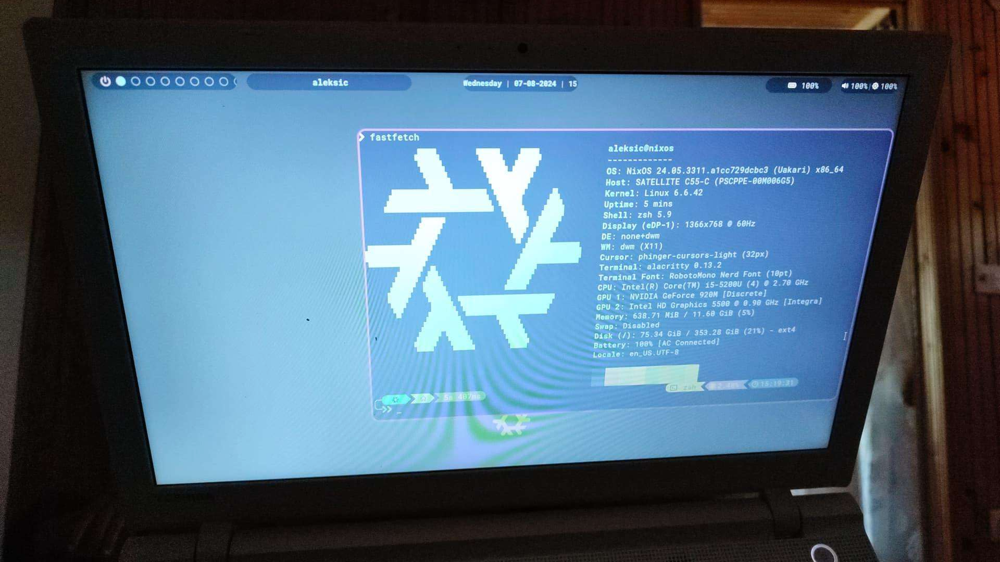
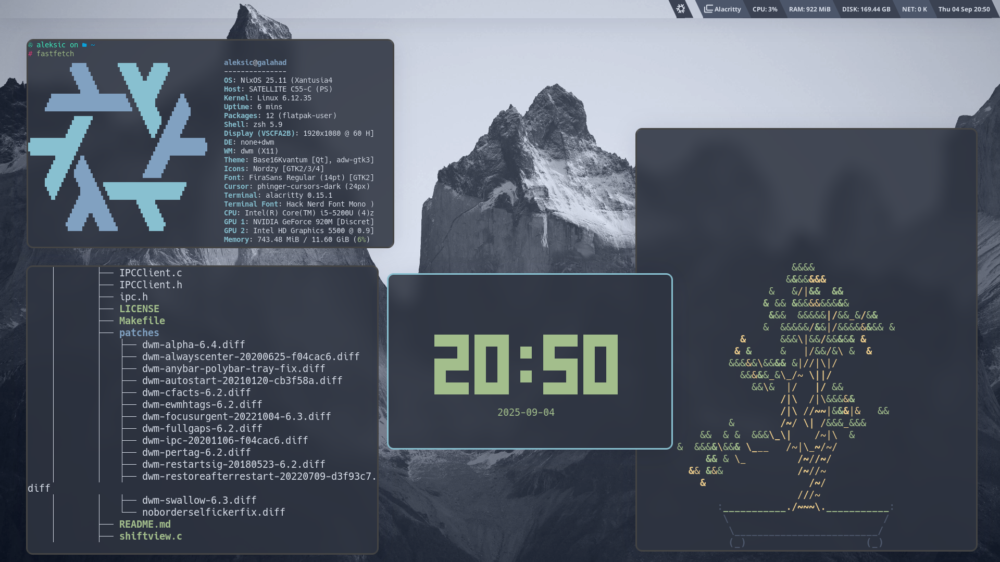
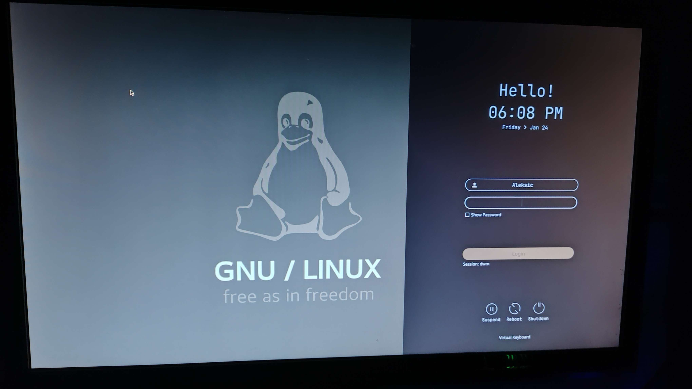
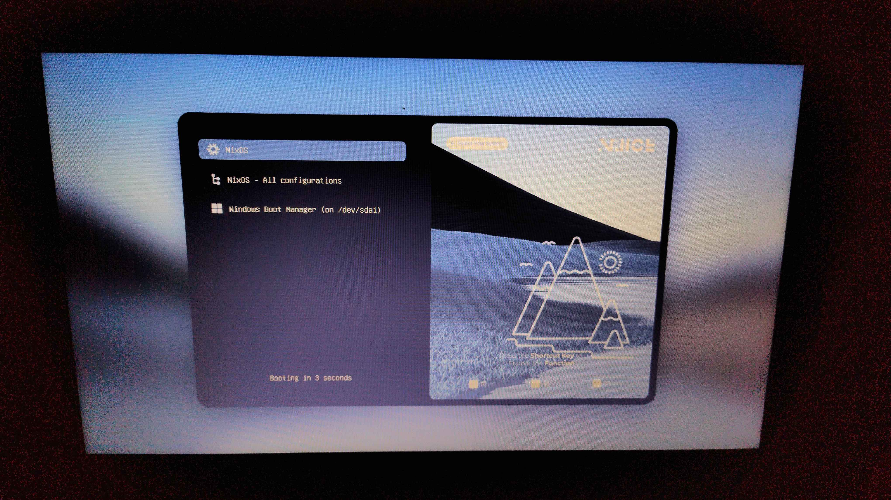

# NixOS Production System (Deprecated)

# Purpose

Meant to be the all-stable system that will always  
work on boot and always allow me to do my work with  
no maintainance or upgrading. Focuses on a stable  
text editor with supports for lsp, linters, and  
everything along, and tooling for hacking.

And it has also been a great resource for me to learn  
more about hardware configuration, bootloaders, kernel  
configurations, torification, mining, graphic desing,
and the list truly goes on...

# Versions

The system has been continually maturing alongside me  
and my journey according to my needs, these are just  
the certain states of it I'd like to capture.

## Experimental

This was at the time of me learning all the features  
of the nix language and getting acustomed to the  
functional programming paradigm.  
Was mainly a single file configuration with no modularity.

### Lavender

## Heavily Riced

My full plunge into Nix, while also focusing on having  
a pretty looking system. Here everything got modularized  
expanded, turned into flakes and improved upon.

### Nord

## Final Minimalist

As my system evolved through time, and expanded further  
I decided to focus more on ergonomics and impact than looks.  
As this system matured many of the expensive features got  
stripped away, and supports for lots of languages and tooling  
got implemented along the way, as well as custom configurations  
for basically any application I was using, or even service and daemon.
It also served as to mine Monero XMR, and host a Tor node.
And within this time I've competed at the national competitive  
programming competition and created my own colorscheme.

### Nord & Custom Scheme

## Extra

These are things that haven't really changed  
throught time, except for plymouth which is  
why it isnt here.

### Lockscreen

### Bootloader

# Conclusion

This has been my production system for a long time,  
it has served well to learn a large number of things. 
However I decided to abandon it due to NixOS avoiding many of  
the common linux challenges I wished to face, as well as 
the general complexities of system management.

Maybe NixOS is an Oasis that excludes all the stability  
and management problems of the usual linux distros,  
but that along with the differing in the FHS and toolchains  
makes it not the best place for learning.

A part of my decision has also been influenced  
by the leading developers of NixOS and their  
behavior, opinions as well as decisions,  
in regards to many things.
